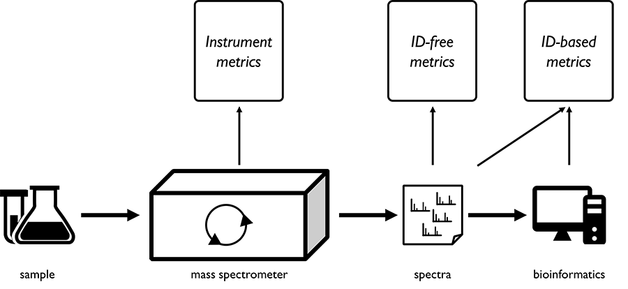

Evaluation of computational QC tools for mass spectrometry proteomics
=====================================================================

For more information:

* [Official code website](https://bitbucket.org/proteinspector/qc-evaluation/)

This code compares the performance of various sets of QC metrics, derived at different stages of the mass spectrometry process, in discriminating low-quality from high-quality experiments.

The software is available as open-source under the Apache 2.0 license.

Dependencies
------------

The code is fully written in Python 3. The required external modules are available in the file `requirements.txt` and can be installed directly via pip.

Contact
-------

For more information you can visit the [official code website](https://bitbucket.org/proteinspector/qc_analysis/) and send a message through Bitbucket or send a mail to <wout.bittremieux@uantwerpen.be>.
